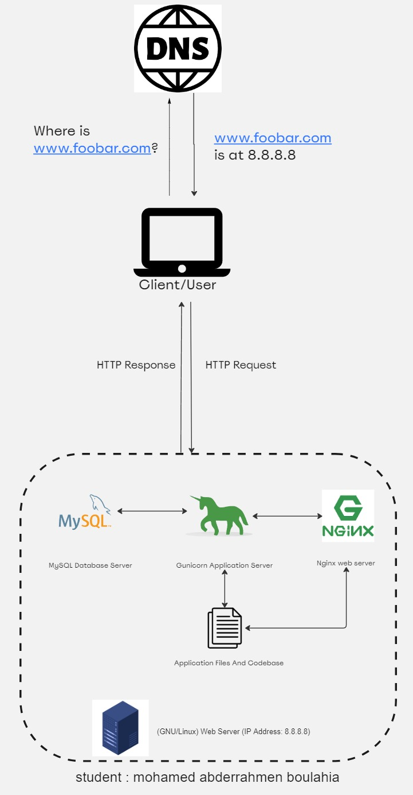

# Simple Web Stack

[Link of Board](https://miro.com/app/board/uXjVNydD-DM=/)

## Description
outlines a straightforward web infrastructure hosting a website accessible through www.foobar.com. Notably, the server lacks firewalls or SSL certificates to safeguard the network. Resource sharing, including CPU, RAM, and SSD, is essential among components such as the database and application server.

## Specifics About This Infrastructure
Server Definition A server, whether hardware or software, provides services to other computers known as clients.

Domain Name's Function The domain name serves as a human-friendly alias for an IP Address, enhancing accessibility. For instance, www.wikipedia.org is more recognizable than 91.198.174.192. This mapping is established in the Domain Name System (DNS).

DNS Record for www in www.foobar.com www.foobar.com utilizes an A record, verifiable through dig www.foobar.com. Note: While results may vary, this design employs an A record. 
<i>An Address Mapping record (A Record), also known as a DNS host record, stores a hostname and its corresponding IPv4 address.</i>

Web Server's Role The web server, whether software or hardware, accepts HTTP or secure HTTP (HTTPS) requests and responds with the requested resource's content or an error message.

Application Server's Purpose The application server is responsible for installing, operating, and hosting applications and associated services for end users, IT services, and organizations. It facilitates the hosting and delivery of high-end consumer or business applications.

Database's Role The database maintains an organized collection of information that is easily accessible, manageable, and updatable.

Communication Protocol between Server and Client Communication between the client and server occurs over the internet network through the TCP/IP protocol suite.

## Issues With This Infrastructure
Single Points of Failure (SPOF) The infrastructure faces multiple SPOFs; for instance, if the MySQL database server is down, the entire site experiences downtime.

Downtime during Maintenance Maintenance checks on any component necessitate either putting them down or turning off the server. As there's only one server, the website experiences downtime during these procedures.

Scalability Constraints Scaling this infrastructure proves challenging due to the consolidated components on one server. Increased incoming traffic may lead to resource depletion or slowed performance.