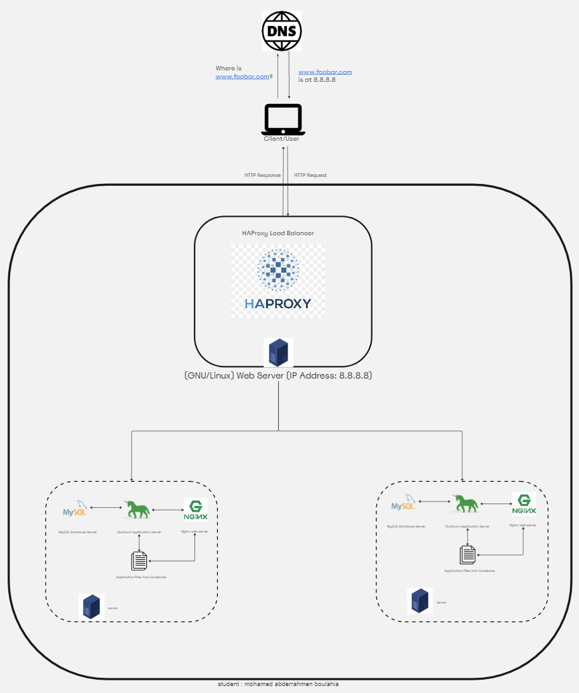

# Distributed Web Infrastructure

[Link of Board](https://miro.com/app/board/uXjVNyckfIs=/)

## Description
This document outlines a distributed web infrastructure aiming to alleviate traffic on the primary server by distributing the load to a replica server with the assistance of a load balancer responsible for balancing the load between the primary and replica servers.

## Infrastructure Details
Load Balancer Configuration and Distribution Algorithm The HAProxy load balancer is configured with the Round Robin distribution algorithm. This algorithm cycles through each server behind the load balancer based on their weights. Known for its fairness, Round Robin ensures an equally distributed processing time among servers. As a dynamic algorithm, weights can be adjusted on the fly.

Load-Balancer-Enabled Setup The HAProxy load balancer facilitates an Active-Passive setup, as opposed to an Active-Active setup. In Active-Active, the load balancer distributes workloads across all nodes to prevent overload. This setup enhances throughput and response times. Conversely, an Active-Passive setup designates specific nodes as active or passive, allowing the next passive node to become active if the preceding one is inactive.

Database Primary-Replica (Master-Slave) Cluster Operation In a Primary-Replica setup, one server serves as the Primary with read/write capabilities, while the other acts as a Replica with read-only capabilities. Data synchronization occurs when the Primary server executes a write operation.

Difference Between Primary and Replica Nodes in Application Usage The Primary node handles all necessary write operations for the site, while the Replica node processes read operations, reducing read traffic to the Primary node.

## Issues With This Infrastructure
Multiple Single Points of Failure (SPOF) If the Primary MySQL database server experiences downtime, the entire site cannot make changes. The server housing the load balancer and the application server connecting to the primary database server are also potential SPOFs.

Security Concerns Data transmitted over the network lacks encryption via an SSL certificate, exposing it to potential spying by hackers. Additionally, the absence of a firewall on any server leaves no means to block unauthorized IPs.

Lack of Monitoring The status of each server remains unknown as they are not under monitoring. This absence of monitoring poses a challenge in assessing the health and performance of the infrastructure.