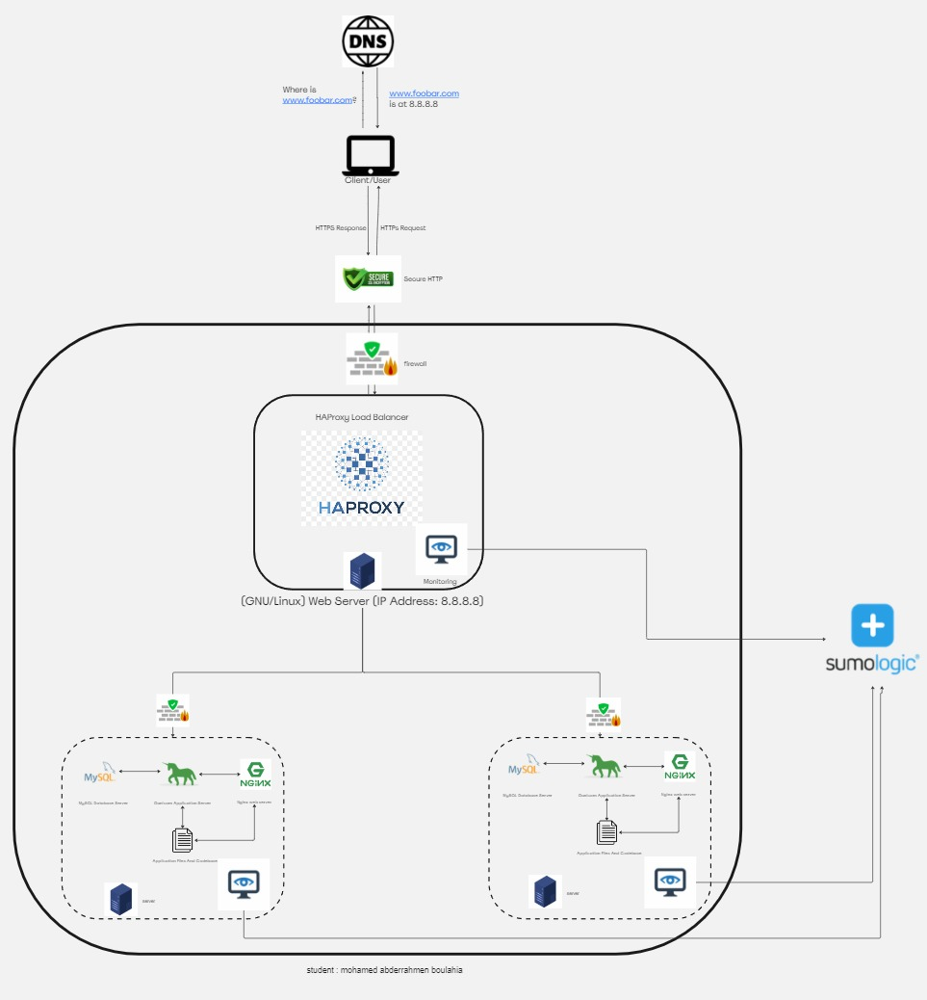

# Secured and Monitored Web Infrastructure

[Link of Board](https://miro.com/app/board/uXjVNyckc8Q=/)

## Description

This documentation presents a 3-server web infrastructure that prioritizes security, continuous monitoring, and the provision of encrypted traffic.

## Infrastructure Details
Firewall Purpose Firewalls are implemented to safeguard the network, specifically the web servers, from unwanted and unauthorized users. Acting as intermediaries between the internal and external networks, they block incoming traffic that matches predefined criteria, ensuring network protection.

SSL Certificate Purpose SSL certificates serve the purpose of encrypting traffic between the web servers and the external network. This encryption prevents potential man-in-the-middle attacks (MITM) and network sniffers from intercepting valuable information. SSL certificates guarantee privacy, integrity, and identification.

Monitoring Clients Purpose Monitoring clients play a crucial role in overseeing both servers and the external network. They analyze server performance, assess overall health, and promptly alert administrators to any deviations from expected performance. The monitoring tool observes servers, providing administrators with key metrics on server operations. It conducts automated tests to check server accessibility, measure response time, and issue alerts for various issues such as corrupt or missing files, security vulnerabilities, and other potential problems.

## Issues With This Infrastructure
Terminating SSL at the load balancer level poses a risk, leaving the traffic between the load balancer and web servers unencrypted.
The presence of a single MySQL server raises scalability concerns, potentially acting as a single point of failure for the entire web infrastructure.
Servers with identical components may contend for resources like CPU, Memory, and I/O, leading to performance issues. This setup is not easily scalable and can complicate problem identification.