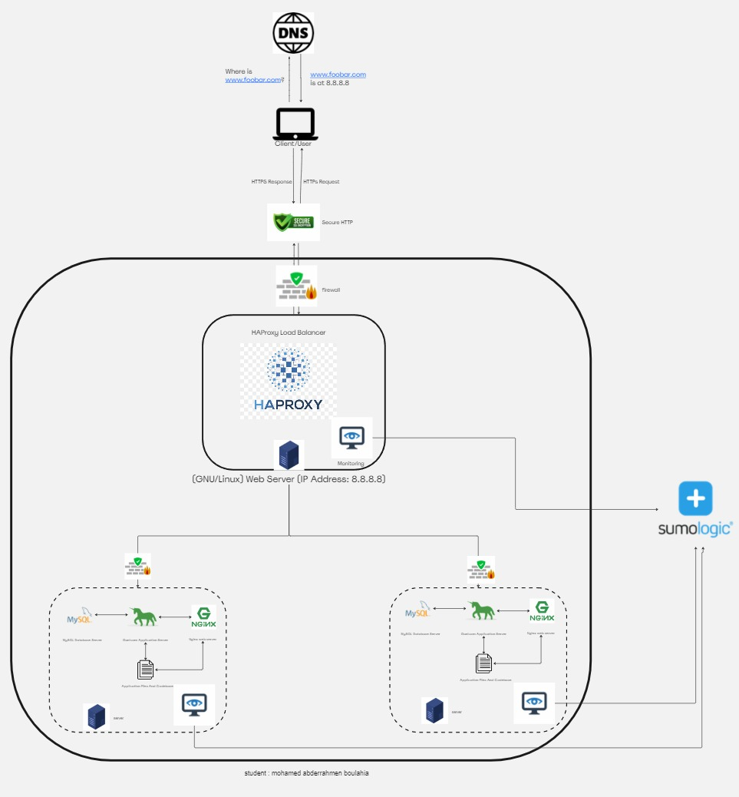

# Scaled Up Web Infrastructure

[VLink of Board](https://miro.com/app/board/uXjVNyckcME=/)

## Description

This web infrastructure represents an expanded version of the previously detailed infrastructure found here. In this iteration, all Single Points of Failure (SPOFs) have been eliminated, and each significant component (web server, application server, and database servers) has been relocated to distinct GNU/Linux servers. SSL protection is not terminated at the load balancer, and each server's network benefits from firewall protection while being actively monitored.

## Specifics About This Infrastructure

Introduction of Firewalls Between Servers This strategic addition places a firewall between each server, providing individual protection against unwanted and unauthorized users. Unlike the previous setup, where the firewall safeguarded a single server, this approach enhances overall security.

## Issues With This Infrastructure

Elevated Maintenance Costs The decision to allocate each major component to its dedicated server comes with increased maintenance costs. This expansion necessitates acquiring more servers, contributing to a rise in the company's electricity expenses. Allocating funds for the purchase of additional servers and covering the increased electricity consumption poses financial considerations for the company.